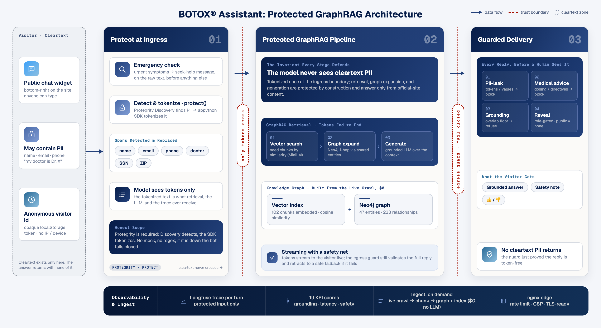

# BOTOX® Information Assistant: a protected GraphRAG chatbot

A production-grade Q&A chatbot for [botox.com](https://www.botox.com), built as a floating widget
that appears bottom-right on the site. It answers general questions about BOTOX® treatments using
**only** content from the official site, protects any personal information a visitor types, and
never gives medical advice.

This is a real-use-case demo built on the same protected-pipeline principles as the AMLGuard
submission: **tokenize sensitive data at ingress, reason over tokens, guard every reply at egress,
reveal by role**, applied here to the *user's* PII on a public pharma site, with a **GraphRAG**
retrieval core over a Neo4j knowledge graph.

> **Not medical advice.** This assistant shares general, publicly-available information and always
> directs medical questions to a healthcare provider. BOTOX® is a prescription medicine with
> serious risks, including a boxed warning; the bot surfaces safety information and never doses,
> diagnoses, or recommends treatment.

## Setup

This demo shares one Protegrity tier and one observability stack with the AMLGuard submission on the
same host — bring those **shared tiers** up first (from the repo root), then the botox stack itself.

**PII protection requires Protegrity** — there is no mock fallback — so before the bot can answer,
two things must be in place:

1. **The `appython` SDK** (hosted tokenization). It's licensed vendor software, not on PyPI: drop the
   wheel/source into `backend/vendor/` (see [`backend/vendor/README.md`](backend/vendor/README.md)).
   The image installs it at build time.
2. **The shared Protegrity Discovery + Semantic Guardrail services.** They live in the shared DE tier
   (`docker/shared/protegrity/`) that `make shared-up` starts, not in this compose. The bot's backend
   reaches them by name over the external `protegrity-shared` network (`pty-classification:8050`,
   `pty-guardrail:8001`). The images pull from the Protegrity DE registry, so `docker login ghcr.io`
   with a Developer-Edition token first, and set `DEV_EDITION_*` in `.env`. (A self-contained copy is
   still available via `docker compose --profile bundled up` for a standalone run.)

```bash
# 1. shared tiers (repo root): Protegrity DE + observability (Langfuse v4, MLflow, Prometheus, Grafana)
make shared-up

# 2. the botox stack (botox_demo/)
cd botox_demo
cp .env.example .env               # set DEV_EDITION_* (tokenization creds) + BOTOX_LANGFUSE_* keys
docker login ghcr.io               # with a Protegrity DE token (only needed for the bundled profile)
docker compose up -d --build       # Neo4j, backend, frontend — joins the shared Protegrity + obs nets
docker compose run --rm ingest     # crawl botox.com + build the GraphRAG index (one time)
open http://localhost:9001         # the landing page with the chat widget bottom-right
```

The frontend is gated on the backend's `/api/health` reporting **ready**, which requires both the
GraphRAG index and Protegrity to be up, so it won't come up serving a bot that would refuse every
turn. The reasoning model runs with **no cloud account** by default (a local open-source model via
[Ollama](https://ollama.com), $0 per turn; put `ANTHROPIC_API_KEY` or AWS Bedrock creds in `.env`
for a hosted model). Until Protegrity is reachable, `/api/health` reports not-ready and the bot
fails closed.

**Observability:** agent tracing goes to the **shared Langfuse v4** (UI at `http://127.0.0.1:5006`),
into botox's **own** project (org *Protegrity* → project *Botox*), so its traces stay isolated from
AMLGuard's. Add the Botox project's keys as `BOTOX_LANGFUSE_PUBLIC_KEY` / `BOTOX_LANGFUSE_SECRET_KEY`
in `.env`; until then tracing is a no-op and the bot runs unchanged. See
[docs/observability.md](docs/observability.md) for the one-time project + key setup.

**Prerequisite for live answers:** a running Ollama with the model pulled
(`ollama pull llama3.2`), or hosted credentials. Without a model the bot still runs and fails
safely (it returns a grounded refusal rather than a wrong answer).

## Architecture



See [docs/architecture.md](docs/architecture.md) for the full technical architecture (both pipelines,
GraphRAG design, the protection boundary, egress guards, model tiering, observability, and security).

```
INGEST (on demand, live crawl, then a $0 no-LLM build)
  crawl botox.com LIVE (robots-respecting)  →  clean + chunk  →  entity/relation extract  →  Neo4j graph
                                                    ↘ embed chunks → vector index

QUERY (per message, protected end to end)
  user message
    → PROTECT      tokenize the visitor's PII (name, email, phone, doctor) before anything sees it
    → RETRIEVE     GraphRAG: vector search for seed chunks, then graph traversal to related context
    → GENERATE     grounded LLM answer over the retrieved context, the model sees tokens, not PII
    → EGRESS GUARD PII-leak + groundedness + medical-advice checks, fail closed
    → REVEAL       role-gated (public = zero reveal); return a clean answer + safety note

  Every turn is traced to Langfuse v4 (retrieval, the model as a first-class generation with token
  usage, latency, guard verdict, grounding, sources), without the visitor's cleartext PII, the trace
  holds protected text and entity counts only.
```

**Why GraphRAG.** BOTOX treats a dozen distinct conditions, each with its own symptoms, side
effects, and cost programs. A pure vector search answers "what are the side effects" but misses the
*connections* ("which side effects relate to the migraine indication vs. the bladder one"). The
Neo4j graph links Treatments → SideEffects → Warnings → CostPrograms, so retrieval starts from
vector-matched chunks and expands along real relationships, richer, better-cited context.

**Why protect the user side.** The BOTOX content is public; the *visitor's* input is not. On a
real site this widget would see names, emails, "my doctor is Dr. X", "I have a claim for…".
**Detected** PII is tokenized at ingress so it never reaches retrieval, the model, or the trace in
the clear, and the egress guard blocks any reply that would echo a token back. (Detection is
best-effort, see *Honest limitations* for exactly what the demo detector does and does not catch.)

## Safety & compliance posture

| Risk | Control |
|---|---|
| Medical advice / dosing / diagnosis | System prompt forbids it; egress guard **blocks** second-person directives and redirects to a provider |
| Hallucinated facts (wrong drug info) | **Grounded-only**: answers must overlap the retrieved official content or the bot refuses |
| Leaking the visitor's PII | Tokenized at ingress; egress guard blocks any reply containing PII or raw tokens |
| Burying safety information | Safety-flagged chunks are tracked through retrieval; replies carry an Important Safety Information note |
| Scraping / content misuse | robots.txt respected; public marketing pages only; content is summarized + cited, never reproduced at length |

## Deploying beyond local

The demo is built to run **loopback-only** (every published port binds `127.0.0.1`). Before any
non-local or public deployment:

- **Regenerate every default secret.** The repo ships fixed development values that are safe only
  because nothing is reachable off-host: `NEO4J_PASSWORD`, `BOTOX_TOKEN_KEY`, the Botox Langfuse keys
  (`BOTOX_LANGFUSE_PUBLIC_KEY` / `BOTOX_LANGFUSE_SECRET_KEY`), and — if you run the shared observability
  tier — its operator secrets (`LANGFUSE_NEXTAUTH_SECRET`, `LANGFUSE_SALT`, the admin login). Replace
  all of them with strong, private values.
- **Put auth in front of the API.** The proxy rate-limits per IP, but `/api/chat` and
  `/api/feedback` have **no authentication**, add auth (and ideally an edge WAF) before exposing
  them, especially with a hosted model configured, where unthrottled traffic is real spend.
- **Never set CORS to `*` with a hosted-model key.** `BOTOX_ALLOWED_ORIGINS` should list the exact
  site origins; a wildcard plus `ANTHROPIC_API_KEY`/Bedrock creds lets any page drive paid calls.
- **Protegrity is required and fails closed.** Wire `PROTEGRITY_DISCOVERY_URL` + `DEV_EDITION_*`
  before serving; if protection is down the bot refuses turns rather than processing unprotected PII.

## Repository layout

```
botox_demo/
├── docker-compose.yml        # Neo4j + backend + frontend; joins the shared Protegrity + obs nets
├── .env.example              # config (works with defaults)
├── backend/                  # FastAPI + the protected GraphRAG pipeline
│   ├── app/ingest/           #   crawl.py, chunk.py, build_all.py
│   ├── app/graph/            #   extract.py, build_neo4j.py, vectorstore.py (GraphRAG)
│   ├── app/protect/          #   protector.py, user-side PII tokenization
│   ├── app/pipeline/         #   orchestrator.py, llm.py, guardrail.py
│   └── app/api/main.py       #   POST /api/chat[/stream], /api/feedback, /api/support/reveal; GET /api/health
├── frontend/                 # React + TypeScript + Vite chat widget (botox.com branding)
└── docs/                     # architecture, safety notes, developer guide
```

## API

`POST /api/chat` `{message, conversation_id, visitor_id?}` →
```json
{ "answer": "...", "safety": true, "refused": false, "blocked": false,
  "conversation_id": "...", "trace_id": "..." }
```
Sources are **not** returned to the UI (the visitor sees a clean answer); the per-chunk provenance
lives in the Langfuse v4 trace for operators. `trace_id` is echoed back (HMAC-signed) so the widget
can attach a thumbs-up/down.

`POST /api/feedback` `{trace_id, rating}` → attaches a `user_feedback` score (`+1`/`-1`) to that
turn's trace.

`GET /api/health` → readiness (index + Protegrity), `protection` (`up`|`down`), and resolved model.

## Documentation

- [docs/architecture.md](docs/architecture.md): the pipeline in depth, GraphRAG design, protection boundary
- [docs/safety.md](docs/safety.md): the regulated-content posture and every guardrail
- [docs/development.md](docs/development.md): run locally, rebuild the index, swap models
- [docs/observability.md](docs/observability.md): traced KPIs, dashboards to build, privacy guarantees

## Honest limitations

**PII protection is Protegrity, and it is mandatory.** Detection uses Protegrity **Discovery** (a
local ML/NER service that finds names, emails, phones, addresses, DOB, and member IDs) and
tokenization uses the **appython SDK** against hosted Data Protection. There is **no mock and no
regex fallback**: if Discovery or the tokenizer is unavailable, the bot **fails closed**, a turn
returns a safe "try again later" and never reaches retrieval, the model, or the trace, and
`/api/health` reports `ready: false` with `protection: down`. This is enforced at startup (the
backend is not ready until Protegrity is reachable) and per-turn. An urgent-symptom message still
surfaces during a protection outage, because the emergency check runs on the raw text before
protection and makes no external call. Coverage is only as good as Discovery's classifier and the
configured score threshold; a value Discovery does not flag is not tokenized, so tune
`PROTEGRITY_DISCOVERY_THRESHOLD` for the deployment.

**The egress guards are heuristics, not guarantees.** The always-on medical-advice, meta-language,
PII-token, numeric-grounding, and groundedness checks are shallow regex/lexical rules,
defense-in-depth that catches the common cases, not a proof. They can be bypassed by unusual
phrasing, and the grounding floor is a lexical-overlap threshold, not a factuality check. Setting
`PROTEGRITY_SEMANTIC_GUARD=on` layers Protegrity's **Semantic Guardrail** (an ML scan using the
healthcare domain model) on top: it can only *add* a block (e.g. an identifier the lexical checks
missed), it never passes a reply the regex guard rejected, and when the service is unreachable the
regex guard's verdict stands (no safety regression, only reduced observability).

**Other:**
- The knowledge graph is built from a small set of public pages (the crawler stays within
  robots.txt and the marketing site); it is a faithful demo corpus, not the entire site.
- Answer quality tracks the chosen model; the local default (llama3.2) is capable but a hosted
  model answers more fluently. Grounding and safety guards apply identically regardless of model.
- The API is rate-limited at the nginx proxy (per-IP) but has **no authentication**, see
  *Deploying beyond local* before exposing it publicly.
