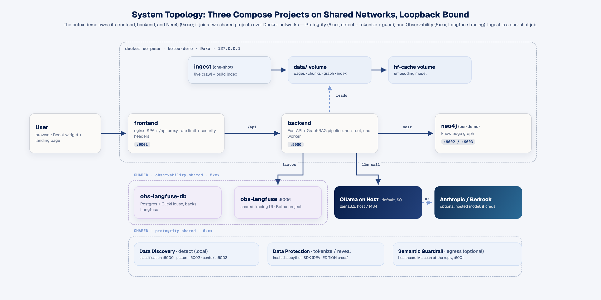
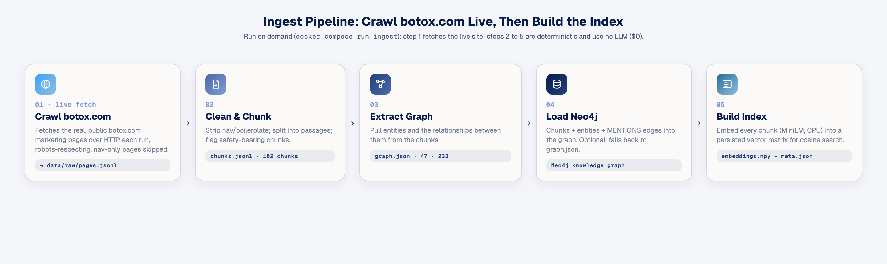
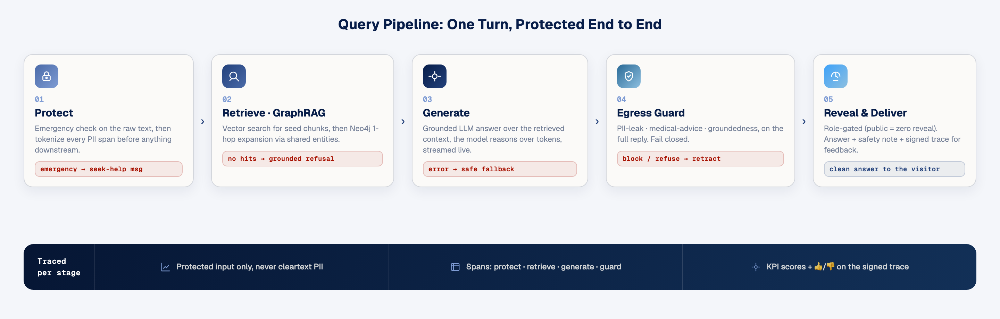
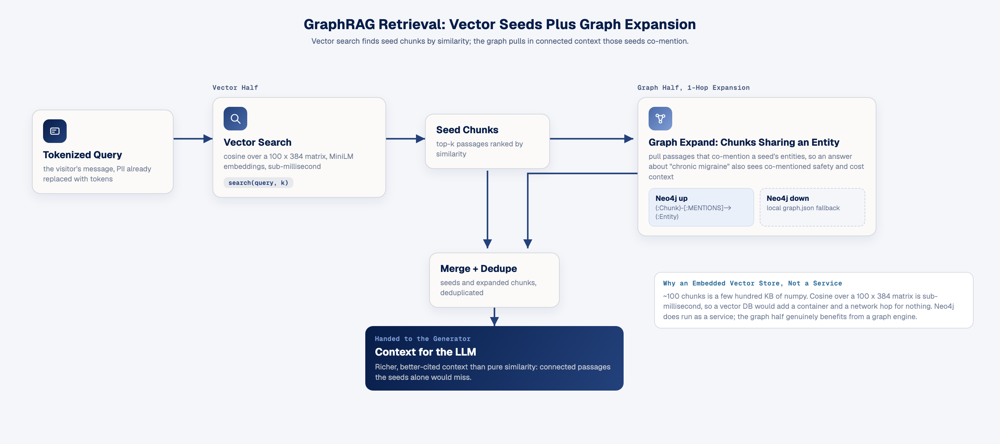
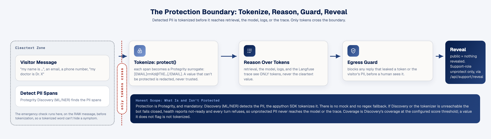
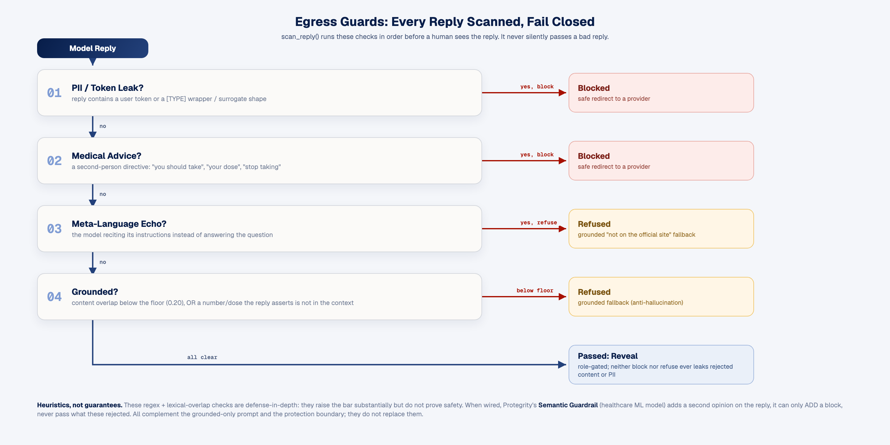
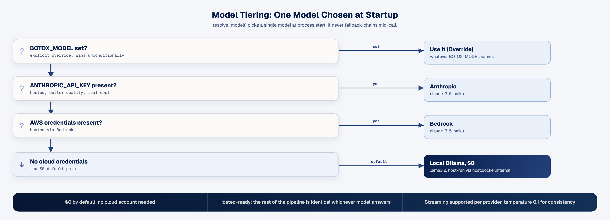
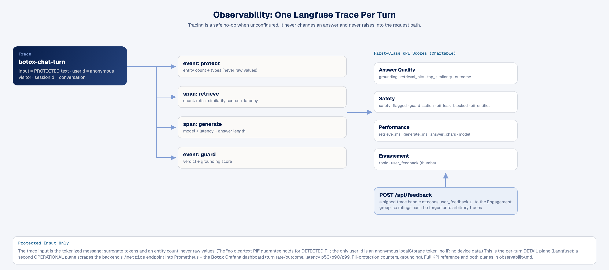

# Technical architecture

The BOTOX® Information Assistant is a public, regulated-pharma Q&A chatbot: a floating widget on an
(original, brand-aligned) landing page that answers general questions about BOTOX® using **only**
content crawled from botox.com, protects any personal information a visitor types, and never gives
medical advice. This document describes how it is built.

It is organised around two pipelines, an **ingest** that crawls the live botox.com site and turns
those pages into a GraphRAG index (the crawl fetches the real site each run; the index build itself
is deterministic and uses no LLM), and a **per-message query pipeline** that answers under a
protect → retrieve → generate → guard → reveal discipline, plus the cross-cutting concerns
(protection boundary, egress guards, model tiering, observability, and security posture).

See also: [safety.md](safety.md) (the regulated-content controls), [observability.md](observability.md)
(the KPI/score reference), [development.md](development.md) (how to run it), and the README's
*Honest limitations* (an honest account of what the demo does and does not protect).

*The three trust zones and two boundaries. Cleartext PII exists only in the visitor zone; only tokens
cross into the pipeline; the egress guard is the second boundary before anything reaches a human. The
[diagram sources](diagrams/) are HTML rendered to 2× PNG (`diagrams/src/render.sh`).*

---

## 1. System overview

This demo's own compose runs three services (Neo4j + backend + frontend), all ports loopback-bound in
the 9xxx band; it joins two **shared, external** tiers on the host — the Protegrity DE tokenizer tier
(6xxx) and the observability stack (5xxx) — brought up once from the repo root (`make shared-up`). The
browser talks only to nginx; nginx serves the built SPA and reverse-proxies `/api` to the backend; the
backend fans out to Neo4j (graph), a host-run Ollama (or a hosted model), the shared Protegrity
Discovery service (`pty-classification`), and the shared Langfuse v4 (`obs-langfuse`, tracing). Ingest
is a one-shot job that shares the backend image and the `data/` volume.

| | |
|---|---|
| **Frontend** | React + TypeScript + Vite SPA (chat widget + landing page), served by nginx which also reverse-proxies `/api`, enforces a per-IP rate limit, and sets security headers. Published on `127.0.0.1:9001`. |
| **Backend** | FastAPI app hosting the protected GraphRAG query pipeline; runs non-root; one worker (holds process-wide singletons: protector, model client, in-memory index). Published on `127.0.0.1:9000`; joins the shared `protegrity-shared` and `observability-shared` networks. |
| **Neo4j** | Community edition; stores the BOTOX knowledge graph (entities, relationships, chunk→entity mentions) for graph expansion. Browser UI on `:9002`, bolt on `:9003`. |
| **Protegrity DE (shared)** | The PII-detection classifier (`pty-classification`, reached in-network on `:8050`) and optional Semantic Guardrail (`pty-guardrail`), living in the shared DE tier — not this compose. See the [shared-infra-decoupling ADR](../../docs/adr/shared-infra-decoupling.md). |
| **Langfuse (shared)** | Self-hosted **v4** (events-only mode) in the shared observability tier, UI at `http://127.0.0.1:5006`. One instance, org *Protegrity*, a project per demo; botox traces into its own *Botox* project via its own keys. Agent tracing, KPI scores, feedback. |
| **Ingest** | One-shot job on the backend image: crawl → chunk → extract graph → load Neo4j → build vector index → seed the managed prompt. Writes the shared `data/` volume. |

---

## 2. The two pipelines

### 2a. Ingest: live crawl, then a $0 no-LLM build

Run on demand (`docker compose run --rm ingest`, which invokes `build_all --crawl`). Step 1
**fetches the live botox.com site over HTTP** each run; steps 2–5 (chunk → extract graph → load
Neo4j → build index) are deterministic and call **no LLM and no paid APIs** ($0). Neo4j is
**optional**, if it is unreachable the chunks, entity graph, and vector index still build, and only
cross-chunk graph expansion falls back to the local `graph.json` map.

**Stages and artifacts:**

| Stage | Module | Output artifact |
|---|---|---|
| Crawl | `ingest/crawl.py` | `data/raw/pages.jsonl`, `{url, title, text, safety_flagged}` per page |
| Chunk | `ingest/chunk.py` | `data/processed/chunks.jsonl`, `{id, url, title, text, safety}` per passage |
| Extract graph | `graph/extract.py` | `data/processed/graph.json`, `{nodes[], edges[], chunk_mentions}` |
| Load Neo4j | `graph/build_neo4j.py` | Neo4j nodes/relationships (idempotent MERGE; fail-soft) |
| Build index | `graph/vectorstore.py` | `data/index/embeddings.npy` + `meta.json` |

- **Crawl** honours `robots.txt` (fetched with a browser UA, urllib's default UA gets a 403 that
  would otherwise disallow everything), stays on the botox.com host, rate-limits politely, and skips
  app/auth/form flows and navigation-only pages (`sitemap` etc., which match every query lexically
  and pollute retrieval). Content is treated as **source to summarize and cite**, never reproduced
  at length.
- **Chunk** splits on sentence boundaries with ~120-char overlap (so a safety clause is never
  severed from its subject) and **re-flags safety per chunk**, page-level `safety_flagged` is
  useless for ranking because every botox.com page carries the ISI footer, so each chunk is
  re-tested against a safety regex.
- **Extract** builds the knowledge graph from a **curated lexicon** seeded from the actual crawled
  content (not an NER model, the domain is small, closed, and safety-critical; a curated lexicon is
  auditable and cannot hallucinate relationships). Relationships come from entity co-occurrence
  within a chunk, typed by the entity-type pair (e.g. SafetyWarning + anything → `WARNS_ABOUT`).
- **`data/` is gitignored**, so on a fresh checkout the ingest job is what populates it; the crawl is
  idempotent and re-run safe.

### 2b. Query: per message, protected end to end

Each chat turn runs through `pipeline/orchestrator.py :: Orchestrator.answer()` (or `answer_stream()`
for the SSE variant). **Every branch fails safe:** an emergency short-circuits to an urgent-care
message; no retrieval hits → a grounded refusal; a guard failure → a safe redirect; a generation
error → a refusal. The model never sees detected cleartext PII, and the answer is built only from
retrieved chunks.

The whole turn is wrapped in one Langfuse trace (`botox-chat-turn`) with spans for retrieve and
generate and scores at each step (see §7). The pipeline yields an `Answer{answer, safety, refused,
blocked, trace_id, …}`; the API returns a **signed** trace handle for feedback and omits sources
from the UI (they live in the trace).

**Streaming variant.** Because the egress guard must see the **complete** reply, streaming uses an
**optimistic-stream-then-guard-retract** model: the backend streams model tokens to the widget as
they are produced (so text appears in ~1s instead of after full generation), and when generation
finishes it runs the same egress guard on the accumulated text. If the guard **blocks/refuses**, a
retract signal tells the widget to replace the streamed text with the safe fallback; otherwise the
stream is finalized. The guarantee is unchanged, nothing unsafe is ever the *final* answer, with a
small, clearly-bounded window where optimistic text is visible before the end-of-turn verdict. The
per-provider streamers live in `pipeline/llm.py :: LLMClient.stream()` (Ollama / Anthropic /
Bedrock); the non-streaming `answer()` path remains for clients that don't stream.

---

## 3. GraphRAG design

Retrieval is **vector search for seeds + graph expansion for connected context**, the two halves
live in `graph/vectorstore.py`.

- **Why both.** Pure vector search answers "what are the side effects" but misses *connections* , 
  which side effects relate to the migraine indication vs. the bladder one. The graph links
  Treatments → SideEffects → Warnings → CostPrograms, so an answer about "chronic migraine" also
  sees co-mentioned safety and cost context even when those passages didn't rank on raw similarity.
- **Embedded vector store, not a service.** The corpus is ~100 chunks, a few hundred KB of numpy.
  Cosine similarity over a 100×384 matrix is sub-millisecond, so a dedicated vector DB would add a
  container and a network hop for nothing. The embedding model is `sentence-transformers/all-MiniLM-L6-v2`
  (small, CPU-friendly, offline after first download; cached in the `hf-cache` volume). **Neo4j does
  run as a service**, the graph half genuinely benefits from a graph engine.
- **CPU torch pin.** `torch` is pinned to a CPU build compatible with the pinned numpy (an unpinned
  torch pulls ~2 GB of CUDA wheels and an incompatible-numpy build would crash `model.encode`).
- **Fail-soft expansion.** `graph_expand` prefers a Neo4j query and falls back to the local
  `graph.json` `chunk_mentions` map when Neo4j is unreachable, so retrieval works with or without the
  service.
- **Process-cached + warmed.** The embedding matrix and metadata load once per process. `warmup()`
  runs at startup to eagerly initialise the encoder (its first `encode()` costs seconds) **and**
  prime the Neo4j driver, so the *first* real user query is fast, not slow.

---

## 4. The protection boundary

The pattern is **tokenize at ingress → reason over tokens → guard at egress → reveal by role**
(`protect/protector.py`). The bot is public and will see personal data ("my name is …", an email, a
phone number, "my doctor is Dr. X"); detected PII is tokenized **before** it reaches retrieval, the
model, logs, or the trace.

- **Protegrity, no fallback.** **Detection** via Protegrity **Discovery** (a local ML/NER service,
  `protect/discovery.py`) and **tokenization** via the **appython SDK** against hosted Data
  Protection (`protect/protector._ProtegrityClient`). There is **no mock and no regex path**. The
  element map follows the SDK's, with the one measured divergence Protometer found: EMAIL uses the
  `string` element, not `email` (the `email` element returns the domain verbatim, leaking it).
- **Fails closed, checked at startup.** If Discovery or the tokenizer is unreachable, `Protector()`
  raises and the pipeline **refuses the turn** (a safe "try again", nothing reaches retrieval, the
  model, or the trace). `/api/health` reports `ready: false` / `protection: down`, so the frontend
  (gated on the backend healthcheck) does not come up serving an unprotected bot. Discovery failures
  and **no-op protections** (a value the API returns unchanged) are both fatal, we never emit
  cleartext under a protection claim, and there is no mock to fall back to.
- **The emergency classifier runs on the RAW message, before tokenization**, by design. It looks
  for symptom words (trouble breathing/swallowing…), not PII, makes no external call, and traces
  nothing in the clear, so an urgent symptom still surfaces even during a protection outage.
- **Coverage is Discovery's coverage.** What gets tokenized is exactly what the Discovery classifier
  flags at the configured `PROTEGRITY_DISCOVERY_THRESHOLD`; a value it does not flag is not
  tokenized. Tune the threshold for the deployment. This is stated plainly in the README's *Honest
  limitations* and in [observability.md](observability.md).
- **The acceptance threshold is DYNAMIC (count-aware).** Discovery's per-span confidence drops in a
  multi-PII sentence — a PERSON that scores ~0.99 alone scores ~0.57 when an email and phone share
  the sentence — so a flat `0.6` would silently DROP the name and leak it in the clear. The client
  queries Discovery at a low floor (`PROTEGRITY_DISCOVERY_QUERY_FLOOR`, default 0.4) to see every
  candidate with its score, then accepts each span at a bar that eases as the message carries more
  distinct PII (`PROTEGRITY_DISCOVERY_RELAX_PER_ENTITY` per extra entity, never below
  `PROTEGRITY_DISCOVERY_MIN_THRESHOLD`). A lone weak span is still rejected (a single word must be
  clearly PII). Set `PROTEGRITY_DISCOVERY_DYNAMIC=off` to pin the flat threshold. See
  `backend/app/protect/discovery.py:_acceptance_threshold`.
- **Reveal is role-gated; the public path never reveals.** The public chat response is always
  zero-reveal, the egress guard proves it is token-free, so there is nothing to re-identify.
  Re-identification exists only on `POST /api/support/reveal` (`Protector.reveal_text` → Protegrity
  `unprotect`), gated by a shared `SUPPORT_API_TOKEN` (Bearer, constant-time compare) and blocked at
  the public nginx edge, so only an internal support tool on the backend loopback can call it. Unset
  the token and the capability is disabled.
- **No unprotect oracle, and reveal survives restarts.** Reveal unprotects a token ONLY if it is in a
  persisted **issued-token allowlist** (SQLite at `data/reveal-registry.db`, 0600), which stores `token → element-type
  element` and **no cleartext**. A token we never minted returns `[unknown token]` (so a support
  caller can't submit guessed tokens to fish for other users' PII), and because the allowlist is on
  disk, a stored transcript still reveals after a restart or from a separate support process
  (reload-on-miss picks up cross-process writes). Cleartext is recovered on demand from Protegrity,
  never stored. A value redacted at ingress is non-reversible and comes back as an explicit marker.

---

## 5. Egress guards

`pipeline/guardrail.py :: scan_reply()` scans **every** model reply before a human sees it and
**fails closed**, it never silently passes a bad reply. It returns a structured `Verdict` the API
and UI act on. The checks run in order:

| Check | Trigger | Outcome |
|---|---|---|
| **PII / token leak** | reply contains a user token or a `[TYPE]` wrapper / surrogate shape | **blocked** |
| **Medical advice** | second-person directive ("you should take", "your dose", "stop taking") | **blocked** |
| **Meta-language** | model reciting its instructions instead of answering | **refused** |
| **Groundedness** | reply's content-term overlap with retrieved context is below the floor (0.20) | **refused** |
| **Numeric grounding** | reply asserts a number (a statistic, a dose) absent from the retrieved context | **refused** |

**Optional ML layer.** `PROTEGRITY_SEMANTIC_GUARD=on` runs Protegrity's **Semantic Guardrail**
(`pipeline/semantic_guard.py`, healthcare domain model) on the outbound reply after the checks above
pass. It only **adds** a block (an identifier the lexical checks missed); it never passes a reply the
regex guard rejected, and when the service is unreachable the regex verdict stands, no safety
regression, only reduced observability.

- **Block vs refuse.** *Blocked* replies (leak / advice) return a redirect to a provider; *refused*
  replies (meta / ungrounded) return the grounded "I don't have that from the official site"
  fallback. Neither ever contains the model's rejected content or the visitor's PII.
- **Groundedness = anti-hallucination.** On a medical topic a confident wrong answer is a safety
  failure, so a reply whose terms don't overlap the retrieved context is refused rather than shown.
- **The `safety` flag reflects the ANSWER, not the sources.** It is set only when the reply itself
  discusses risk/side-effects (keyed on substantive risk language, not the bare word "warning" that
  every source page footers): so the Important Safety Information note appears on risk answers, not
  on every reply.
- **These are heuristics / defense-in-depth, not guarantees.** They are regex- and lexical-overlap
  based; they raise the bar substantially but do not prove safety. They complement, not replace , 
  the grounded-only system prompt and the protection boundary.

---

## 6. Model tiering

`pipeline/llm.py :: resolve_model()` picks **one** model at process start (it does not fallback-chain
mid-call, a lesson from mixing models into one curve):

- **$0 by default.** With no cloud credentials the bot uses a **host-run Ollama** (`llama3.2`),
  reached from the container via `host.docker.internal`. Temperature is low (0.1) for consistency.
- **Hosted-ready.** Setting `ANTHROPIC_API_KEY` or AWS creds switches the tier without touching the
  rest of the pipeline, tokenization, retrieval, and the guards are identical whichever model
  answers. The system prompt hard-constrains the model to grounded, non-advisory, safety-forward
  answers (the guard is the enforcement; the prompt is the first line).
- **Streaming** is available per provider via `LLMClient.stream()` (see §2b for how it composes with
  the egress guard).

---

## 7. Observability

Every turn is traced to the **shared Langfuse v4** (events-only mode, UI at `http://127.0.0.1:5006`),
into botox's own project (org *Protegrity* → project *Botox*) via its own key pair
(`BOTOX_LANGFUSE_*`, read first so its traces never land in Protometer's project). The SDK is Langfuse
`4.14.4` (`obs/tracing.py`), and the model call is emitted as a first-class **generation** carrying
model, token usage, and a link to the managed prompt version. Tracing is a **safe no-op** when
unconfigured, it never changes an answer and never raises into the request path.

- **Protected input only.** The trace `input` is the *tokenized* message, the pipeline tokenizes
  detected PII first, so the trace holds surrogate tokens and an entity **count**, never raw values.
  (The "no cleartext PII" guarantee holds for **detected** PII; see §4 and the honest-limitations
  note.) The only user identifier is an **anonymous** localStorage visitor id, no IP, no device
  data.
- **First-class scores and generation.** KPIs are emitted as Langfuse *scores* (chartable/filterable),
  not just metadata, grounding, retrieval hits, top similarity, guard action, latency, topic, outcome,
  PII counts, and the visitor's thumbs rating; the model call is a real generation observation with
  token usage and its prompt version linked. Full reference and dashboard guidance in
  [observability.md](observability.md).
- **Signed-trace feedback.** The thumbs-up/down loop attaches a `user_feedback` score via a
  **signed** trace handle (see §8), so ratings can't be forged onto arbitrary traces.

---

## 8. Security & deployment posture

- **nginx front door.** Serves the static SPA and reverse-proxies `/api` to the backend, with:
  - **Request-time DNS re-resolution** of the backend upstream (Docker's embedded resolver +
    a variabled `proxy_pass`), so a backend container restart is picked up automatically instead of
    leaving nginx stuck on a stale IP (a 502 trap).
  - **Per-IP rate limiting** (`limit_req`, 20 r/min + burst) on `/api`, a public LLM endpoint is a
    cost/DoS risk without it.
  - **Security headers** on every response (CSP, `X-Frame-Options: DENY`, `nosniff`,
    `Referrer-Policy`, `Permissions-Policy`), re-included per location because nginx doesn't inherit
    `add_header` into a location that sets its own. The app is fully self-contained (no external
    scripts/styles/images), so a strict CSP is safe. `server_tokens off` hides the version.
- **Non-root backend.** The image runs an entrypoint that (as root) chowns the mounted volumes, the
  HuggingFace cache and `data/` mount root-owned the first time, then drops to the unprivileged
  `botox` user via `setpriv` before exec-ing uvicorn.
- **Feedback anti-forgery.** `/api/chat` returns an HMAC-**signed** trace handle (`<trace_id>.<sig>`)
  and `/api/feedback` accepts only handles whose signature verifies, so a caller can't spam or forge
  scores on guessed trace ids.
- **PII-safe logging.** Error paths log the exception **type only**, never the message/args (which
  could carry a fragment of the visitor's input).
- **Loopback-bound ports.** Every published port binds `127.0.0.1`, nothing is exposed off-host in
  the demo.
- **Committed demo secrets, regenerate before any non-local deploy.** The compose ships fixed
  defaults (`NEO4J_PASSWORD`, `BOTOX_TOKEN_KEY`, the Botox Langfuse keys `BOTOX_LANGFUSE_*`, and — for
  the shared observability tier — its `NEXTAUTH_SECRET` / `SALT` / admin password) so the stack runs
  with zero setup. These are fine for loopback-only local use but **must all be regenerated** before
  exposing anything, and there is no built-in API auth yet, add auth + an edge WAF, and never set CORS
  to `*` alongside a hosted-model key. See the README's *Deploying beyond local*.

---

## 9. Component & tech-stack summary

| Component | Tech | Role |
|---|---|---|
| Chat widget + landing page | React 18, TypeScript, Vite | Public UI; floating widget + brand-aligned host page; XSS-safe markdown renderer; anonymous visitor id; thumbs feedback |
| Web server / proxy | nginx (alpine) | Serves SPA; `/api` reverse proxy; rate limit; security headers; request-time upstream resolution |
| API | FastAPI (Python 3.12), uvicorn | `/api/chat`, `/api/feedback`, `/api/health`; input sanitization; signed trace handles |
| Query pipeline | Python | emergency → protect → retrieve → generate → guard → reveal; fail-closed |
| PII protection | Protegrity Developer Edition (Discovery + Data Protection) | Tokenize at ingress, role-gated reveal |
| Retrieval (vector) | sentence-transformers all-MiniLM-L6-v2, numpy | Embedded cosine search over ~100 chunks |
| Retrieval (graph) | Neo4j 5 community | 1-hop entity-shared chunk expansion (fail-soft to local `graph.json`) |
| Reasoning model | Ollama `llama3.2` ($0) / Anthropic / Bedrock | Grounded generation; tiered by config; streaming-capable |
| Egress guards | regex + lexical overlap | Token/PII-leak, medical-advice, meta-language, groundedness, fail closed |
| Observability | Shared Langfuse v4 (events-only) | Per-turn traces, first-class generation with token usage + linked prompt, KPI scores, signed-trace feedback; botox's own project |
| Ingest | httpx, selectolax, curated lexicon | Live crawl of botox.com → chunk → extract graph → load Neo4j → build index (build is $0, no LLM) |
| Orchestration | Docker Compose | One-command stack; loopback-bound; non-root backend; named volumes |

---

## Data & control flow, in one line

**Ingest (once):** crawl botox.com → sentence-aware chunks → curated-lexicon knowledge graph → Neo4j
+ numpy vector index.
**Query (per message):** protect PII → (emergency short-circuit) → vector seeds + graph expansion →
grounded generation over tokens → fail-closed egress guard → role-gated reveal → clean answer +
Langfuse trace + signed feedback handle.
