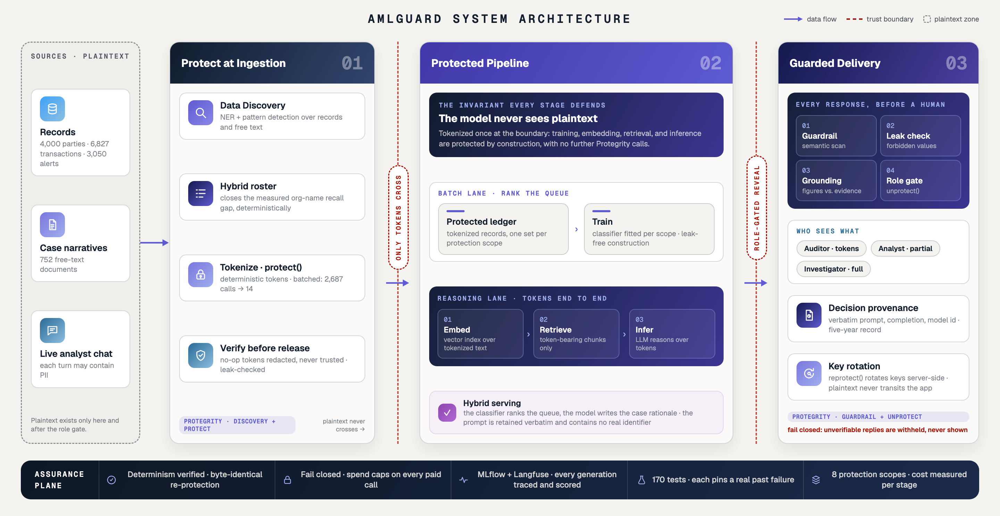
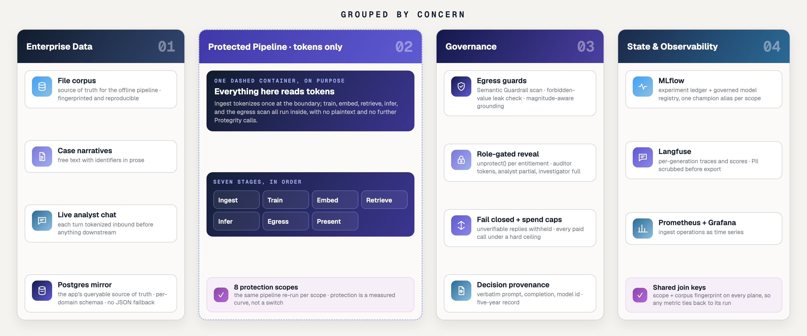
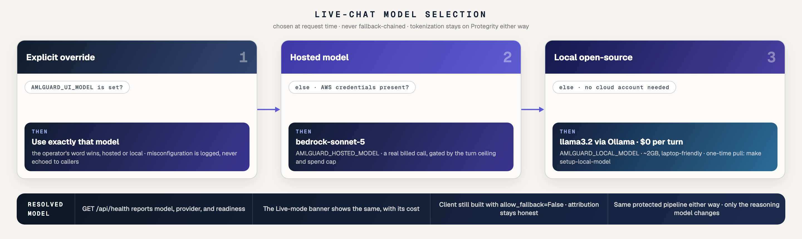

# Architecture: where data protection operates, and what it costs

This document answers the hackathon's core question for AMLGuard, an anti-money-laundering
investigation copilot built on Protegrity Developer Edition: *where in the AI pipeline does
data protection operate, and what does it cost?* It covers the end-to-end
design, the decisions behind it (system design, algorithms, API usage, tooling), the
bottlenecks we hit and how we resolved them, and what we measured.

## The claim

Sensitive data is tokenized at ingestion and **never re-identified until the presentation
boundary**. The language model reasons entirely over pseudonymous tokens. The payload sent
to the model contains no real identifier. That is verifiable rather than asserted:
every investigation retains a verbatim copy of its prompt, and `scripts/verify_protection.py`
independently checks that no in-scope identifier survives anywhere in the protected corpus.

## End-to-end architecture

Every figure shares one design system and regenerates from a committed source — see
[diagrams/README.md](diagrams/README.md).

**Eight protection scopes** are the experiment's independent variable, from `none` (clear
baseline) through `direct` (names, addresses, emails, IDs), `direct-plus-context/-temporal/
-monetary`, `quasi`, `all`, and `direct-nondeterministic` (an IV-rotation ablation). Every
measurement below runs the identical pipeline over each scope, so any difference is
attributable to protection and nothing else.

### The same picture, grouped by concern

A second view renders the identical system as four concern-columns feeding left to right — Enterprise
Data → the dashed **Protected Pipeline (tokens only)** → Governance → State & Observability. It is the
same seven stages above, regrouped so the *protected zone* (the dashed container) is visually one
thing, with governance and durable state as its neighbours rather than an afterthought:

Two things this grouping makes explicit that the linear diagram does not: **durable state is now
Postgres** (the app's queryable source of truth; see below), and the **observability plane carries
the same join keys** — `scope` and the corpus fingerprint — across MLflow, Langfuse, and Prometheus,
so a metric on one plane can be tied to a run on another.

## The application data layer: Postgres

The offline pipeline and the online app make deliberately opposite choices about where the corpus
lives:

- **Offline (pipeline / reproducibility):** the file corpus `data/corpus/*.json` is the source of
  truth. It is what the pipeline fingerprints and reproduces from; `src/amlguard/db.py`'s read
  helpers are fail-soft (return `None`) so a batch script can fall back to the files.
- **Online (the demo/serving app):** Postgres is the source of truth, with **no JSON fallback**. A
  parties or live-chat request returns **503** when the mirror is down or unloaded, rather than
  silently serving data the operator never loaded. `scripts/load_corpus_db.py` rebuilds the mirror
  from the JSON and stamps the corpus fingerprint; it is a deploy step, run before serving.

The mirror is **relational**, not a JSON blob column: `CORPUS_SCHEMA` in `db.py` defines each table
with typed columns, foreign keys to `parties`, and indexes, per-domain schema (`aml`, `healthcare`,
`support`). Un-modelled fields ride along in a per-row `extra` jsonb, and `read_table` reconstructs
the original record shape — coercing DB-typed values (Decimal, date) back to the corpus's JSON
representation so a reconstructed record is always serialisable. MLflow's backend deliberately stays
on SQLite (the model-registry alias API is broken against Postgres in the pinned version).

## The demo UI and live-batch execution

`ui/api/app.py` (FastAPI) + `ui/web/` (vanilla-JS single page) is a judge-facing seam over the same
library functions and committed artifacts; it re-implements no pipeline logic. Three endpoint tiers,
by cost and effect:

- **Read / Replay** — serve the committed, verified artifacts; $0, no side effects. The batch stepper
  is Replay-first: each stage reveals the real run's metrics/plots.
- **Live-local** — run a cheap local primitive for real (a protected chatbot turn over
  `ConversationSession`, a re-identification, a de-id or dual-gate stage); $0 hosted (a chat turn is
  a billed LLM call, gated by a shared-secret + turn-ceiling abuse rail).
- **Live-batch** — `POST /api/batch/run-stage` runs one stage for real behind four rails: **estimate-first with a server-issued single-use confirm token** (a scripted client
  cannot self-mint it and skip the human cost-confirm), a **cross-process run-lock → 409** so a UI
  run never races a CLI run, **`data/eval/_live/<run_id>/` isolation** so a live run can never
  clobber the committed artifacts, and the same **spend cap** the CLI uses.

The batch stepper is **per-domain**: AML shows the 7-stage curve; healthcare shows Safe Harbor →
Expert Determination (HIPAA residual-risk before/after k-anonymization); customer-support shows the
role dual-gate. The parties preview returns only a safe column allow-list — clear
ssn/credit-card/DOB/account fields are dropped at the seam regardless of auth, because the pipeline
exists to protect exactly those. Live chat runs in all three domains, each protected against its
own party corpus; a domain whose corpus is not loaded fails closed with a precise loader message
rather than mis-seeding protection from another domain's entities.

### Live-chat model selection: runs with or without a cloud account

The live chat picks its model at request time (`resolve_ui_model()` in `ui/api/app.py`), so a fork
runs whether or not the operator has cloud credentials, without changing the `allow_fallback=False`
invariant that keeps serving-model attribution honest. Precedence: `AMLGUARD_UI_MODEL` (explicit
override) → the hosted model (`AMLGUARD_HOSTED_MODEL`, default `bedrock-sonnet-5`) when AWS
credentials are detected → an **open-source model served locally by Ollama** (`AMLGUARD_LOCAL_MODEL`,
default `llama3.2`, ~2GB) otherwise. Tokenization always stays on Protegrity Developer Edition; only
the reasoning model changes, so the protected pipeline is identical either way. The model is chosen,
not fallback-chained: `resolve_ui_model` selects a *reachable* model and the client is still built
with `allow_fallback=False`. `GET /api/health` reports the resolved model, its provider, and
readiness; the UI's Live-mode banner surfaces the same, and the one-time model pull is either
`make setup-local-model` or `AMLGUARD_AUTO_PULL_MODEL=true`. In Docker the app reaches Ollama on the
host by default (`host.docker.internal:11434`); an in-stack `ollama` service is available behind the
opt-in `local-model` Compose profile.

## Decision log

The choices that define the system, the alternatives we weighed, and why we chose as we did.

### System design

| Decision | Alternatives considered | Why this one |
|---|---|---|
| Tokenize-then-embed; unprotect only at presentation | Encrypt-at-rest with clear compute; redaction; prompt-time masking | Only topology where every intermediate store (vectors, model context, caches, traces) is clean **by construction**. Redaction destroys utility unrecoverably; masking at prompt time leaves stores dirty |
| Identity resolution via never-tokenized surrogate keys | Search by name over protected text | Measured: semantic search cannot locate a party by name once tokenized (26/40 → 1/40). Keys keep structured lookup intact and are the deliberate residual-risk trade, which we then attack ourselves (52.0% neighbourhood linkage) and disclose |
| Deterministic detection + LLM interpretation | LLM does ledger arithmetic | Measured: a 14B model summing a 14-row ledger returned $47,596/10 txns where the answer was $66,733/7. Rules compute on the *protected* ledger (so they degrade exactly as deployment would); the model explains. A hallucinated figure in a SAR narrative is a false statement to a federal database |
| Egress as a first-class stage | Trust the prompt-side controls | Protection on the way in says nothing about the way out. Guardrail scan + forbidden-value check + groundedness marking on every rationale |
| Rank-based triage, order-never-suppress | Score thresholds; volume tuning | Review capacity is a headcount, so a fixed threshold floods a small team or idles a large one while rank adapts to capacity (calibration is fine at ECE 0.021; that is not the argument). FFIEC examination procedure #12 forbids tailoring alert volume to staffing; the ranker orders and never drops |
| Fail-closed guards on the analyst path; best-effort counted guards in the measurement harness | One failure semantics everywhere | The two contexts need opposites: a control that silently disables itself is theater, but a sidecar hiccup zeroing a utility score records infrastructure noise as model degradation. Each context gets the semantics its risk demands |
| Measurement as product: one command per curve, resume-safe, statistically framed | Ad-hoc benchmark scripts | McNemar + bootstrap CIs + MDE turn a null into a bounded claim; resume + caching make the whole curve repeatable for the cost of what changed |

### Data structures & algorithms

| Decision | Alternatives | Why |
|---|---|---|
| Hand-built graph features (guilty walks, scatter-gather, cycles ≤6, k-core, PageRank, sampled betweenness) | GNN (GAT/GCN) | Follows the two *published production* systems (Feedzai: +11.6pp recall from neighbour degree aggregation, +13.4pp from illicit-terminating walks; IBM's Graph Feature Preprocessor: scatter-gather + cycles). Explainable to an examiner; SHAP independently reproduces those systems' feature ordering. A GNN adds opacity for no measured gain at 2.5k nodes |
| Temporal instance split + dual-membership exclusion; graph and aggregates fit on training fold only | Random transaction-level split | A typology is 3-11 related transactions; a row-level split puts the same instance on both sides. Every leak class we identified is closed in **one construction seam** (`build_classifier`) that all consumers share; a multi-piece assembly callers must get right is one they eventually get wrong |
| Roster exact-match with C-speed containment prefilter | Second NER model | The entities discovery misses are not unknown; they are enumerated in the party master. Exact matching is complete over that population and fully explainable. The `name in text` prefilter removed >99% of 33M regex scans per ingest (20.6s → 0.5s per 100 docs) |
| Disk memo for graph features: atomic tmp+rename writes, self-healing corrupt reads, key derived from *every* feature-shaping parameter | Recompute each run; hand-versioned cache key | 9.47M cycle enumerations (~134s) ran on every training and hybrid invocation; memoized 108×. Party ids are scope-invariant so concurrent scope runs share one path: writes must be atomic and reads must recover, and a cache key you must remember to bump is a cache key that eventually lies |
| Content-hash everything: corpus fingerprints, classifier hash over feature-matrix digest, cache keys over full request incl. decode config | Timestamps; version strings | Reconstructability is a five-year AML obligation. Same inputs = same key = same result; changed decode config = different key = no silent cross-serving |
| Alert-grain queue with saturating urgency | Transaction-grain; unbounded urgency | Transaction grain collapsed 50 queue slots to 17 subjects (one party ten times). Unbounded urgency degenerated to "oldest first" on a replayed corpus where most alerts are late. Urgency saturates; evidence discriminates among the equally late |

### API usage

| Decision | Alternatives | Why |
|---|---|---|
| Discover once, batch `/protect` by data element | SDK's `find_and_protect` per document | Reference pattern costs one round-trip per entity per document (~1,800 calls); batching cost **14**. Sound only because we verified determinism first: same value, same token, byte-identical re-protection proven live |
| One authenticated client per process | Client per scope/retry | `/auth/login` is rate-limited **separately** from `/protect`, and the SDK reports its 429 as a credential failure. One login per process; sessions renew freely |
| Compare every token to its input; redact no-ops | Trust success codes | `protect("seven hundred twelve thousand dollars", "number")` returns the input unchanged *with a success code*. Emitting plaintext under a protection claim is a correctness failure |
| Pace under the burst limit; never retry a refused login | SDK default retries | The burst limit returns **403** (not 429, which is all the SDK retries) and blocks ~4 minutes; retrying a refused login extends the block |
| Bedrock Converse for hosted inference, with `cachePoint` prompt caching and reasoning disabled in model config | Direct Anthropic/OpenAI APIs | Spend on the AWS bill, IAM-governed, inside a boundary a bank already controls; prompt caching measured at ~10× on repeat input cost. Claude 5 reasons adaptively by default; on hard prompts the whole decode budget went to reasoning with zero answer text, so the eval declares `thinking: disabled` as a config-visible measurement condition (fixed budget, spent on the answer) |
| `reprotect` for key rotation | Unprotect-then-reprotect client-side | Server-side migration means plaintext never transits the application; demonstrated live in the demo, round-tripping to both original plaintext and original token |

### Tools

| Decision | Alternatives | Why |
|---|---|---|
| MLflow (self-hosted Docker, SQLite-backed) for experiments + model registry | W&B; flat files | Every run stamped with the parameters that determine comparability (scope, model, corpus fingerprint, detection ledger, cache state); classifiers logged with signatures as `amlguard-<scope>`; server-first with same-store SQLite fallback so a down server never loses a run |
| Langfuse (self-hosted v4) for prompt-level traces | MLflow GenAI tracing; log files | The reviewable unit of an LLM pipeline is the generation: prompt, completion, model, tokens, cost, cache state, latency. Captured at the one seam every call crosses (`LLMClient`), with run verdicts as scores. One tool per job. Loopback-bound and memory-capped because traces store prompts at rest |
| SHAP TreeExplainer, interventional mode, real background, probability units | Default path-dependent mode | Our features are heavily correlated (origin/beneficiary mirrors, degree family), exactly where path-dependent attribution spreads credit along correlations. With a training-fold background and probability output, "raises the score by 0.034" is literally in score units (additivity verified to 1e-6), and cross-scope reliance shift is what turns "AP dropped 10%" into "the model stopped using amounts" |
| ChromaDB + local MiniLM embeddings | Hosted embedding APIs | Nothing leaves the machine during indexing; that is the point |
| Config-driven model layer (12 models, 4 providers, YAML) | Hard-coded client | The architecture's claims must not depend on a vendor, and a reviewer must be able to reproduce on whatever they have. Swapping is a flag |
| Everything optional degrades to a no-op | Hard dependencies on telemetry | A measurement harness that cannot run without its telemetry has inverted its purpose |

## Pipeline stages in detail

### 1. Ingestion (`ingest.py`, `protect.py`, `roster.py`)

Two paths, because structured and unstructured data have different problems. **Structured**
fields go straight to batched protection, grouped by data element and deduplicated. Column-wise, so call count scales with fields
rather than records. **Unstructured** case
notes need entities found first: Protegrity's local Data Discovery classifies each document,
entities are collected corpus-wide, protected in batches, and spliced back by character
offset.

**Bottleneck → fix:** the reference `find_and_protect` flow costs one HTTPS round-trip per
entity per document: ~1,800 calls for this corpus, against a hosted rate limit. We verified
determinism first (undocumented, but real across four data elements), then batched by
element: **14 calls**. A later full re-protection of a scope reproduced **byte-identical
output**, which doubles as the reconstructability proof.

**Bottleneck → fix:** measured discovery gaps would have silently voided the protection
claim: ORGANIZATION detection returns zero at every threshold on a corpus that is 45%
organizations; phone numbers are intermittently missed; prose dates and European decimals are
invisible. Our detection is therefore **hybrid**: discovery first, then a roster of every
known party name and identifier value claims what discovery left behind, longest-match-first
so `Meridian Holdings Ltd` is never shadowed by a shorter entry. Every entity records its
source, so discovery's real coverage stays a measured quantity (attribution reported per
scope).

Two silent-failure classes are guarded: the `datetime` element accepts ISO-8601 only (a
rejected batch retries value-by-value so only genuinely bad values are redacted), and the
`number` element returns some inputs unchanged with a success code (every token is compared
to its input; no-ops are redacted).

Measured cost of a full scope ingest: **671s wall-clock, of which 650s (97%) is the local
discovery service and 13.9s is Protegrity's hosted API**, 123 calls, 23,414 values, 10%
token-cache hits. The protection API is not the bottleneck; local NER is.

### 2. Training (`training.py`, `graph_features.py`)

A `RandomForestClassifier` predicts whether a transaction belongs to a laundering typology,
fitted **per protection scope on that scope's protected ledger**. This is genuine supervised
training on protected data, and deliberately not described as LLM fine-tuning.

Format-preserving tokenization does not remove a feature; it **corrupts** it: a tokenized
amount still parses as a plausible number carrying a meaningless magnitude. The classifier
sees wrong data rather than missing data: the harder failure, and the one a deployment
would actually meet.

Feature engineering follows the two published production systems rather than invention
(Feedzai's neighbour-degree and guilty-walk features; IBM's scatter-gather and cycle
motifs), and SHAP independently ranks guilty-walk distance and cycle count top, matching the ordering
those systems report. Metrics are chosen for how AML models are judged: accuracy is
useless at an 8% base rate, so **precision@k** is the operational number. On the clear
ledger: AP 0.473, precision@25 **0.92**, @50 0.84, lift@25 **11.8×**, ECE 0.016.

**Bottleneck → fix:** naive splitting quietly inflates every number. A transaction-level
split cannot isolate a typology planted as related transactions; a graph built over the full
ledger gives training rows features computed over the test fold; walks that may reach
test-labelled nodes encode the answer one hop removed. The split is **temporal**, illicit
sets are training-fold-only with dual-membership exclusion, and graph and population
aggregates fit on the training fold. All of it lives inside the single `build_classifier`
seam, so no consumer can re-assemble it wrong.

**Bottleneck → fix:** cycle enumeration alone is 9.47M cycles (~134s) and ran on every
training and hybrid invocation. The extraction is disk-memoized (atomic writes, self-healing
reads, key derived from every feature-shaping parameter) for a 108× speedup on the hot
path; scopes share one cache path since party ids are scope-invariant.

Every training run logs to MLflow with the fitted model, inferred signature, input example,
and registry entry; the classifier hash (a digest over the feature matrix and parameters)
rides as a cross-checking tag.

### 3. Embedding (`retrieval.py`)

Narratives are embedded **after** tokenization, locally (all-MiniLM-L6-v2), and indexed in
ChromaDB. No text leaves the machine during indexing, and the vector store never holds a
real identifier.

This is where the architecture's central trade-off becomes visible (measured, not assumed):

| Query type | Baseline | Protected (`direct`) |
|---|---|---|
| Behavioural (five queries about activity) | found **4/5** | **4/5, unchanged** |
| Identity (forty queries naming a party) | found **26/40** (65%) | **1/40 (2.5%)** |

Fisher's exact on the identity arm: **p = 4.2 × 10⁻⁹**. Both arms score the same way:
recall of a known-correct document in the top 10. We insisted on that after finding that
"mean distance of the top hit" cannot detect retrieval failure at all (in a
several-hundred-document index, something is always nearby). Indexes carry a corpus
fingerprint and refuse to serve a stale corpus.

Non-identifying metadata (party ids, risk ratings, jurisdictions) is deliberately left
unprotected and queryable, which keeps structured filtering intact.

### 4. Retrieval (`pipeline.py`)

An investigation opens on a **party id**: a surrogate key that identifies no person and is
never protected. That is the architectural response to the erasure finding above. Around that entry
point the pipeline assembles a two-hop transaction network for the prompt (deterministic
detection scans up to five hops), because a three-transfer layering chain touches its
subject only in the first hop; a subject-only view makes the pattern structurally invisible.

Candidate typologies and their exact figures are computed by rules **over the protected
ledger** (so where amounts are tokenized, the detectors degrade exactly as a deployment's
would) and handed to the model as evidence to interpret, never to recompute.

### 5. Inference (`llm.py`)

Provider-agnostic and configuration-driven. The layer provides deterministic decoding
(temperature 0, fixed seed), disk caching keyed on the full request *including decode
configuration*, per-call token/cost/latency accounting, retry with jittered backoff on
transient failures only, a hard pre-call spend cap reserved under a process-wide ledger
lock, and per-generation tracing to Langfuse.

The model is told its tokens are stable pseudonyms. Without that instruction, models treat
opaque strings as noise and decline to reason; with it, they use tokens as identity anchors,
which is exactly what deterministic tokenization makes possible.

**Bottleneck → fix:** hosted providers throttle bursty workloads, and a generic fallback
chain will silently hand a throttled call to a local model, poisoning any measurement
whose premise is "same model, only the corpus changes." We saw this fire in early runs,
so the design makes it impossible where it matters: evaluation
clients are **fallback-forbidden**, a distinct `SpendCapExceeded` can never enter a fallback
path, and every artifact stamps the answering model per task with a scope-level
`models_used` carrying the evidence rather than the claim.

**Bottleneck → fix:** Claude 5 on Bedrock reasons adaptively by default; on hard prompts the
entire 900-token decode budget went to a `reasoningContent` block with zero answer text. We
declare `thinking: disabled` in the model config as a reviewer-visible measurement
condition, and fold request-shaping fields into the cache key so completions produced under different
decode configs can never be served interchangeably.

### 6. Egress (`guardrail.py`)

Everything above protects data on the way *in*; this stage inspects what comes back.
Protegrity's Semantic Guardrail runs locally with no API key and scores model output for
identifiers. Using it well meant measuring exactly where it succeeds and fails (v1.1.1):

| Case | Service verdict | This system |
|---|---|---|
| Response leaking a name + email | rejected **0.9909**, with offsets | blocked (service verdict stands) |
| Correct rationale citing `P02386` | **rejected 0.7202** as `USER_NAME` | **discounted** |
| Response naming a real corpus organization | **approved, score 0.0** | **blocked** |

The two gaps are complemented differently because they are different kinds of gap.
**Surrogate keys are a knowledge gap**: party ids appear in every legitimate rationale, and
the service cannot know they identify rows, not people. We adjudicate by analysing the
*flagged spans themselves*: a finding is discounted only when every flagged span is a
surrogate key, failing closed on unparseable spans. Over 100 shipped rationales, 1 was
withheld and 30 surrogate-key false positives were discounted; a guardrail that blocks a
third of correct answers is one an operator switches off. **Out-of-distribution names are a coverage gap**:
the service approved, at score 0.0, a response naming a real corpus organization. A
forbidden-value check seeded from the clear corpus (held at the trust boundary anyway)
catches it, and is what makes the guard load-bearing.

Prompt-injection scanning is deliberately **off**: measured over five benign analyst queries
and five injection attempts, the available processor scored benign 0.620-0.782 against
malicious 0.615-0.759: fully overlapping, all rejected. We report the measurement rather
than invent a threshold it does not support.

On the analyst path the guard **fails closed**: an unreachable service raises rather than
silently disabling itself. In the measurement harness the same scan is per-task best-effort
with an explicit `scan_failed` bucket. Opposite semantics for opposite risks.

### 7. Presentation (`reidentify.py`)

The only place tokens become plaintext. Round-tripping relies on the wrapper tags ingestion
emits (`[PERSON]token[/PERSON]`), which carry the entity type and therefore the element to
unprotect with; unprotect calls are batched per element.

**Role gating is application-enforced, and we state that wherever it is shown.** Developer
Edition provides no local policy configuration (`check_access()` is a stub returning `True`;
the shipped sample maps every user to `superuser`). Three roles are defined (Auditor sees nothing, Analyst
sees counterparty structure, Investigator sees everything), enforced by this application; Team Edition's `pty-migrate create-policy` is where the enforcement would
properly live in production.

Key rotation is demonstrated live (`scripts/demo.py`, stage 8): `/reprotect` migrates tokens
between element namespaces server-side, round-tripping to both original plaintext and
original token, with the application never holding plaintext during the migration. Its
undocumented batch success code (50) is pinned by a test.

### Observability (`tracking.py`, `observability.py`, `metrics_export.py`)

Two self-hosted planes with a deliberate division of labour, both optional by construction
(no server, no keys, or an env kill-switch ⇒ no-op):

* **MLflow** (`http://localhost:5001`) is the experiment ledger: every run with the
  parameters that determine comparability, metrics, artifacts, and the fitted classifiers
  logged with signatures into the registry as `amlguard-<scope>`.
* **Langfuse** (`http://127.0.0.1:3000`) is the prompt-level record: every LLM call (eval
  task, judge grade, rationale, preflight) captured as a generation with prompt,
  completion, model, tokens, cost, cache state, latency; run-level verdicts (grounded rate,
  egress outcomes, queue precision) attached as scores. Because traces store prompts at
  rest, every port in the stack is loopback-bound, services are memory-capped, and volumes
  stay out of git.
* **Prometheus + Grafana** (`http://localhost:3001`) is the operational plane for
  ingestion, the one batch stage whose health is a time-series: rate, per-scope
  duration, discovery share of wall-clock, no-op and failure counts. The job pushes
  to a Pushgateway (the batch pattern: a scraped endpoint would be empty between
  runs), Prometheus scrapes it, Grafana dashboards it. This is deliberately NOT in
  MLflow, which is for experiment comparison, not operational time-series.

All three are optional (kill switches `AMLGUARD_NO_TRACKING` / `_NO_TRACING` / `_NO_METRICS`,
each with a no-op degrade path); the pipeline never depends on any of them.

**How the three planes join.** Every fact carries at least one shared key, so a run can be
reassembled into one view (`scripts/observability_report.py` performs the join):

| Key | Set by | Joins |
|---|---|---|
| `run_id` | one `uuid4` per process (`persist.RUN_ID`) | all three planes + result artifacts, for one process run. In Langfuse this is the `sessionId` (the v4 observations-list API returns `sessionId` but omits `metadata`, so join on `sessionId`, not `metadata.run_id`). |
| `corpus_fingerprint` | hash of the five clear-corpus files | ties a run to the exact corpus it measured, across stages |
| `classifier_hash` | digest over feature matrix + parameters | ties a hybrid queue to the exact model that ranked it, and to its training run |
| `scope` | the protection scope | slices any metric by protection level |

*Worked example — "everything about one training + hybrid run":* take the `run_id` from
`hybrid_none.json` → MLflow's run tagged `amlguard.run_id` carries the scores + registered model →
Langfuse session `<run_id>` holds the rationale generations and run-level scores → Prometheus's
ingest series (joined via `corpus_fingerprint`) gives the protect-call latency behind that corpus →
the champion model `models:/amlguard-none@champion` closes the loop back to the artifact.

**Model & prompt governance.** MLflow 3 uses **aliases + tags**, not the deprecated stage names:
each scope's newest model is aliased `@champion` (tagged `classifier_hash` / `corpus_fingerprint` /
`average_precision` / `run_id`), superseded ones `@archived-vN`, and consumers resolve
`models:/amlguard-<scope>@champion` rather than a hardcoded version (`scripts/govern_models.py`
reconciles this idempotently from `training.json`). The three system prompts live in the Langfuse
prompt registry — versioned in the UI, seeded from code constants, resolved via
`observability.managed_prompt` with a constant fallback — so a prompt change needs no code deploy and
the pipeline never depends on the registry being up.

### Hybrid triage (`hybrid.py`, `alert_queue.py`)

Spanning training and inference: the classifier ranks the review queue and the model
generates a case-note rationale for the head. The justification is regulatory rather than
economic: FFIEC requires a designated decision maker able to *justify* a filing, and a
score is not a justification.

The queue is at **alert grain** (the unit an analyst dispositions), ranked on a composite an
examiner can be told in three sentences: model evidence, days remaining on the 31 CFR
1020.320 filing clock (saturating; among equally late alerts, evidence discriminates), and
repeat-alert history. Triggering is by rank, not score threshold (ECE 0.021 means a
threshold fires on a number that lies), and the component **orders, never suppresses**.

| Scope | P@50 | Distinct subjects | Egress (blocked/discounted) | Ungrounded | Cost |
|---|---|---|---|---|---|
| `none` | 0.48 | 18/25 | 0/6 | 0/25 | $0.17 |
| `quasi` | 0.48 | 19/25 | 0/7 | 0/25 | $0.17 |

(Regenerated per-scope detail: [`results-aml.md`](results-aml.md).)

**Bottleneck → fix:** our first prototypes produced flattering precision that our own
adversarial review dismantled: transaction-grain ranking collapsed 50 queue slots to 17
subjects, and an inline classifier had drifted from the training pipeline's leak-free
construction. The rebuilt queue is alert-grain, window-restricted, ranks on the shared
`build_classifier` seam, and its alerts fire causally after their evidence exists. The
structural ceiling under this construction is ~0.54, so ~0.35 is a strong lift over random ordering,
findable at a 3.7% base rate (a **7.5× lift**), and the number survives scrutiny.

Each rationale persists its verbatim prompt, raw completion, model id, timestamp, and
classifier hash, plus analyst-disposition fields; figures with no basis in what the model
was shown are marked per decision; and a feature glossary supplies meaning *and direction*
for every attribution the model narrates. What changes under protection is the *evidence
cited*, not the ability to reason: at baseline the rationale leans on values, under
protection on topology. Graph invariance surfaces in the reasoning layer.

## What was measured

Full results, generated from artifacts: [results-aml.md](./results-aml.md). The shape of the answer:

- **Training:** AP 0.473 clear → 0.451 with AMOUNT tokenized (95% retained on this corpus; the AMOUNT cost is single-seed sensitive, ~10% on another draw); identity
  protection is free; SHAP shows `amount`/`amount_log` dropping out of the model entirely.
- **Embedding/retrieval:** behavioural queries unchanged, identity queries collapse
  (p = 4.2 × 10⁻⁹). The trade-off is quantified per query type, which we did not find in
  published work.
- **Inference:** a bounded null with coherent direction: baseline 0.821, protected scopes
  0.750-0.838, every comparison inconclusive at MDE ~9 points. The curve is single-model
  verified per task, $2.71 end-to-end.
- **Egress:** over 100 shipped rationales: 1 withheld, 30 surrogate false positives
  discounted, 0 value leaks; eval-path scans blocked 0-5 responses per protected scope.
- **Attacks:** neighbourhood linkage 52.0% (0.04% on the relabeled-graph control,
  computed every run): the residual risk stated with the protection claim.

## Grounding in external frameworks

The controls map to named actions in **NIST AI 600-1** (Generative AI Profile), and the gaps
are named there too:

| Control in this system | NIST AI 600-1 action |
|---|---|
| Groundedness gate on rationale figures | MS-2.5-003 (verify sources/citations in output), MS-2.5-005 |
| Egress PII scan on every model response | MP-4.1-009 (detect PII in generated output), MP-4.1-001 |
| Role-gated presentation; human retains filing judgment | GV-3.2-001…005 (human oversight configuration) |
| Decision provenance (prompt, completion, model, hash, timestamp) | GV-1.5-001 (content provenance / verification) |
| **Not built, named gaps** | MS-2.7 (prompt injection), MS-1.1-008 (structured red-teaming), MG-4.1 (post-deployment monitoring) |

The same controls against **OWASP Top 10 for LLM Applications (2025)**:

| OWASP risk | This system |
|---|---|
| LLM01 Prompt injection | Measured, not mitigated: the available processor scores benign and malicious prompts overlappingly, so prompt scanning is off and the residual risk is disclosed rather than dressed up |
| LLM02 Sensitive information disclosure | The core thesis: tokens-only past ingestion, egress scan + normalized forbidden-value check on every response, role-gated re-identification |
| LLM05 Improper output handling | Rationales are scanned, ground-checked, and provenance-stamped before a human sees them; blocked output is withheld without echoing what was caught |
| LLM06 Excessive agency | The model orders nothing and closes nothing: it explains a queue a deterministic ranker built, and the analyst decides |
| LLM08 Vector store weaknesses | The vector store never holds a plaintext identifier, so its compromise is priced into the threat model and attacked directly (the linkage suite) |
| LLM09 Misinformation | The groundedness gate marks unevidenced figures per decision; glossary-anchored attributions stop feature-name confabulation |
| LLM10 Unbounded consumption | Hard pre-call spend reservation under a process lock; a breached cap stops the run and can never enter a fallback path |

Domain grounding, primary sources only: **Wolfsberg** (Second Statement on Effective
Monitoring) endorses outcomes-based ML monitoring with explainability as its third pillar;
the SHAP glossary and validation framing map onto it. **AMLworld** (NeurIPS 2023)
establishes temporal splits as the benchmark standard and does not report per-typology
recall at all, making the breakdown here more granular than its references;
TBML-invisibility on ledger-only data is consistent with Egressy et al. (AAAI 2024).
**Romanini et al.** (2020) shows 1-hop neighbourhood re-identification is near-binary above
average degree ~10, so our 52.0% is conservative within the published range. **FATF/FinCEN**
endorse PETs for collaborative analytics, but **no regulator document endorses tokenization
for model training specifically**; that claim is this project's measurement, presented as
such. BIS **Project Hertha** (2025) is the nearest published corroboration that
network-level analytics detect what account-level monitoring misses.

## Tech stack

- **Protection**: Protegrity Developer Edition — Data Discovery (classify), tokenization
  (protect/unprotect/reprotect), Semantic Guardrail (egress scan), Anonymization, Synthetic Data.
- **ML / retrieval**: scikit-learn RandomForest + graph features, SHAP, sentence-transformers MiniLM,
  ChromaDB.
- **Serving**: FastAPI + a vanilla-JS single-page UI (`ui/`).
- **Data layer**: Postgres is the app's source of truth (relational corpus mirror); the file corpus is
  the offline/reproducibility source of truth. MLflow's backend stays on SQLite.
- **Observability**: MLflow, Langfuse, Prometheus + Grafana (see above).
- **Packaging**: fully dockerised as one Compose project (app + Postgres + the vendor DE services +
  every observability plane); see [SETUP.md](SETUP.md).

## Key invariants (don't relearn these)

- One Protegrity login per process (`/auth/login` is rate-limited separately from `/protect`; the SDK
  misreports its 429 as bad credentials). Never retry a refused login.
- Tokenization is deterministic; `protect` can return input unchanged with a success code — no-ops are
  redacted, never trusted.
- Evaluation clients stay `allow_fallback=False`; a fallback chain once silently mixed three models
  into one curve. After any paid run, check `models_used` in the artifact.
- Docs claim only what a script regenerates (`docs/results-*.md` via `scripts/generate_results.py`).
- Guards fail closed on the analyst path, best-effort-with-counting in the measurement harness —
  opposite semantics for opposite risks, both deliberate.

## Verification culture

Every major error in this project's history produced a *better-looking* number, so a convenient result
is treated as a defect until independently checked (the "convenient-number rule"). The test suite pins
past failures — each test exists because a specific bug actually happened. Run `python -m pytest
tests/ -q` after touching `hybrid.py`, `llm.py`, `graph_features.py`, `training.py`, or `protect.py`.

## Honest limitations

- **The determinism ablation returns an inconclusive null.** The ablation scope scores
  0.738 against `direct`'s 0.721, a noise-level difference in the "wrong" direction
  (paired: -0.017 [-0.059, 0.000], p = 1.0), far too wide to claim equivalence.
  Diagnosed: the discriminating task depends on retrieval, and retrieval cannot assemble
  identity-linked documents once names are tokenized, in either arm. Determinism's
  demonstrated value is **operational** (801 API calls instead of 37,629 for the ablation
  scope; 14 instead of ~2,687 for the corpus), not analytical.
- **Roster fallback covers known values, not arbitrary prose.** In deployment the roster is
  the customer master (the population an institution must protect), but novel entities in
  free text depend on the discovery service, whose coverage we measure rather than assume.
- **Scopes closer than four checkpoints are not distinguishable** at this task count and are
  reported as such rather than ranked.
- **Findings are single-corpus and single-seed.** The committed artifact set covers one
  hosted model; an earlier local-model run showed the same shape but predates two corpus
  corrections, so cross-model reproduction is a claim we retired rather than kept.
- **The corpus is easier than real AML**, deliberately and iteratively so: across successive
  hardening rounds we removed nine detection giveaways our own review found (channel labels,
  amount separation, degree leakage, memo vocabulary, reference formats, amount ceilings).
  Each removal dropped the classifier's score and raised the result's credibility. It
  remains easier than production data, so absolute scores should be read as comparative
  between scopes rather than as AML performance.
- **The illicit population is 10.2% of parties**, against well under 1% in real data, so
  guilty-walk features are more informative here than they would be in production.
- **No model was fine-tuned.** The training stage is a supervised classifier, which
  satisfies the challenge's training stage but is not LLM fine-tuning, and we do not claim
  it is.

## Where to go deeper

- **[protegrity-api-reference.md](protegrity-api-reference.md)** — measured platform behaviours (burst
  limits, format sensitivity, element mappings).
- **[../ui/README.md](../ui/README.md)** — the demo UI, its endpoint tiers, and the local-model setup.
- **[SETUP.md](SETUP.md)** — clone → running demo. **[product-and-use-cases.md](product-and-use-cases.md)** — the product view.
